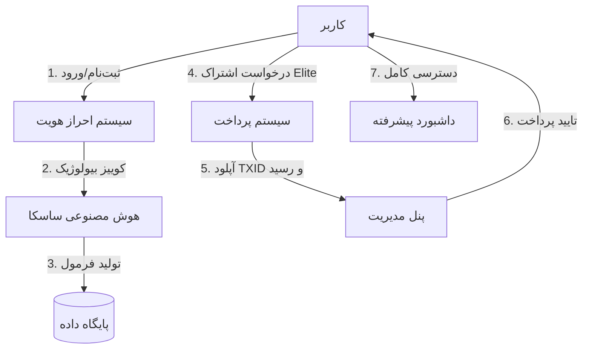

# 🏋️‍♂️ Mokammel Fit Pro - Enterprise Edition

**اولین پلتفرم هوشمند طراحی مکمل اختصاصی در ایران، بر پایه هوش مصنوعی ساسکا (SASKA)**


## 📋 معرفی پروژه
این پروژه یک پلتفرم کامل (Full-Stack) برای تحلیل بیولوژیک کاربران و ارائه برنامه مکمل بدنسازی اختصاصی است. سیستم از یک معماری ترکیبی شامل **Frontend (React)** و **Backend Services** استفاده می‌کند و با هسته هوش مصنوعی **Google Gemini** ادغام شده است.

### ویژگی‌های کلیدی
- **هوش مصنوعی ساسکا (SASKA AI)**: موتور تصمیم‌گیرنده برای تحلیل داده‌های فیزیولوژیک.
- **ویژن هوشمند (Vision AI)**: قابلیت اسکن تصویری مکمل‌ها و غذا برای آپدیت خودکار فرمول.
- **سیستم پرداخت کریپتو (USDT)**: درگاه پرداخت غیرمتمرکز با تایید دستی ادمین.
- **پنل مدیریت پیشرفته**: داشبورد کامل برای مدیریت کاربران، تراکنش‌ها و رویدادهای سیستم.
- **طراحی RTL و فارسی**: رابط کاربری کاملاً بومی‌سازی شده با فونت وزیرمتن.

---

## 🏗 معماری سیستم (System Architecture)



---

## 🚀 راهنمای نصب و راه‌اندازی (Deployment)

### پیش‌نیازها
- Docker & Docker Compose
- Node.js v20+ (برای توسعه لوکال)
- کلید API معتبر Google Gemini

### 1. تنظیمات محیطی (.env)
یک فایل `.env` در ریشه پروژه بسازید:

```env
# تنظیمات پایگاه داده
POSTGRES_USER=mokammel
POSTGRES_PASSWORD=secure_password
POSTGRES_DB=fitpro

# تنظیمات امنیتی
JWT_SECRET=super_secret_jwt_key_change_me
API_KEY=your_google_gemini_api_key

# تنظیمات عمومی
NODE_ENV=production
PORT=3000
```

### 2. اجرای با Docker (توصیه شده)
برای اجرای کل پشته نرم‌افزاری (Frontend + Backend + DB + Nginx):

```bash
docker-compose up -d --build
```

پس از اجرا:
- **فرانت‌‌اند**: `http://localhost:3001`
- **پنل ادمین**: از طریق منوی کاربری (با ایمیل `admin@fitpro.ir`)

### 3. توسعه لوکال (Frontend Only)
اگر فقط می‌خواهید روی فرانت‌‌اند کار کنید:

```bash
npm install
npm run dev
```

---

## 🛠 استک فنی (Tech Stack)

### Frontend
- **Framework**: React 18 (Vite/Next pattern)
- **Styling**: TailwindCSS + RTL Plugins
- **Icons**: Heroicons
- **State**: React Hooks + LocalStorage Persistence

### Backend Services (Simulated Layer)
- **Auth Service**: مدیریت نشست‌ها و نقش‌های کاربری (RBAC)
- **Payment Service**: مدیریت تراکنش‌های USDT و آپلود رسید
- **Event Service**: ثبت لاگ‌های سیستمی برای Audit

### AI Core
- **Model**: Gemini 1.5 Pro / Flash
- **Capabilities**: Text Generation, Vision Analysis, TTS (Text-to-Speech)

---

## 🔐 حساب‌های کاربری تست

| نقش (Role) | ایمیل | رمز عبور | دسترسی‌ها |
| :--- | :--- | :--- | :--- |
| **Admin** | `admin@fitpro.ir` | `admin123` | دسترسی کامل به پنل مدیریت، تایید پرداخت‌ها |
| **User** | (ثبت‌نام کنید) | (دلخواه) | دسترسی محدود، امکان خرید اشتراک |

---

## 📄 لایсنس
تمامی حقوق محفوظ است برای **Mokammel Fit Pro**.
توسعه داده شده توسط تیم فنی فیت پرو.
