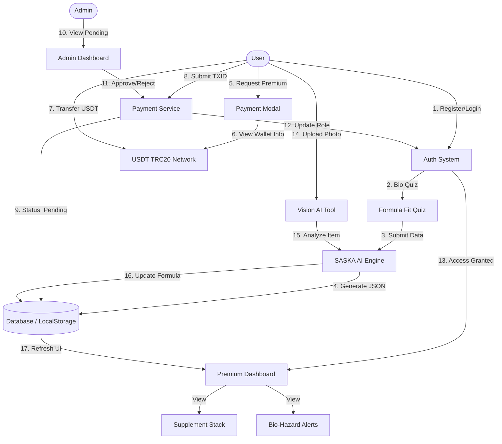

# Mokammel Fit Pro - System Architecture & Flow

## 1. System Overview
Mokammel Fit Pro is an AI-powered fitness and supplementation platform. It uses a **Hybrid Architecture**:
- **Frontend**: React + Tailwind (Client Side).
- **Backend (Simulated)**: `utils/` services handling logic via `localStorage` (Auth, Payment, Event Logs).
- **AI Core**: Google Gemini API acting as the "SASKA" engine and Vision processor.

## 2. Master Flow Diagram



## 3. Key Modules & Workflows

### A. Subscription Payment (USDT TRC20)
Since we use Crypto (USDT) instead of a banking gateway, the flow is asynchronous:
1.  **User** opens `PremiumModal`.
2.  **System** displays Wallet Address (`TRC20`) and Amount (`1 USDT`).
3.  **User** transfers funds via Exchange (e.g., OKEx) or Wallet.
4.  **User** submits the Transaction ID (TXID).
5.  **System** saves request as `pending`.
6.  **Admin** verifies TXID in `AdminPanel`.
7.  **Admin** clicks "Approve".
8.  **System** upgrades User Role to `premium`.

### B. SASKA AI Engine (Logic)
The AI is not just a chatbot; it acts as a **Decision Engine**.
*   **Input**: Quiz Data (Age, Weight, Goal, Sleep, etc.).
*   **Process**:
    1.  Calculates Stress Level & Recovery Status.
    2.  Selects Priority (Sleep vs. Nutrition vs. Performance).
    3.  Selects Supplement Stack based on rules (e.g., "If sleep < 6h, add Magnesium").
    4.  Generates Safety Alerts (e.g., "Creatine requires 3L water").
*   **Output**: Structured JSON (`AnalysisResult`) stored in DB.

### C. Vision AI Integration
*   **Input**: Image of a supplement bottle or a meal.
*   **Process**:
    1.  `gemini-2.5-flash` identifies the item (Name, Dosage/Calories).
    2.  Data is fed back into SASKA.
    3.  SASKA checks for interactions with the *current* stack.
*   **Output**: Updates the User's Formula (e.g., adds the new supplement to the stack or adds a warning).

## 4. Data Structure (JSON)

The frontend consumes a unified JSON structure for the dashboard:

```json
{
  "formula": {
    "code": "MFP-8921-SLEEP",
    "summary": {
      "stressLevel": "high",
      "proteinNeed": "moderate"
    }
  },
  "stacks": [
    { "name": "Magnesium", "dosage": "400mg", "timing": "Before Bed" },
    { "name": "Whey Protein", "dosage": "30g", "timing": "Post Workout" }
  ],
  "alerts": [
    { "type": "interaction", "message": "Avoid Calcium with Magnesium", "severity": "medium" }
  ]
}
```

## 5. Security Protocols
*   **Role-Based Access Control (RBAC)**:
    *   `User`: Can view basic dashboard, cannot see detailed dosages.
    *   `Premium`: Full access to dosages, timings, and AI Chat.
    *   `Admin`: Access to Admin Panel, Payment Approvals, User Management.
*   **Client-Side Security**: Routes are protected via `user.role` checks in React components.
